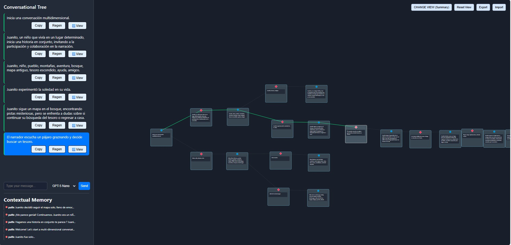
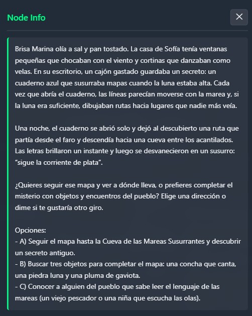

# Storm_gpt

## Tematica
Interaccion con modelos de Lenguaje.

## Problema
-LINEALIDAD vs Ramificacion. Problemas tanto para el Usuario como para el modelo provocado por la incapacidad de ramificar conversaciones. (orden, claridad, manejo de variantes y contexto)
-Conversaciones largas e dificiles de entender con LLM --> se pueden resumir --> y ver de diversas formas (imagenes, nemotecnia)
## Objetivo
Facilitar la interacción con modelos de LLM a través de la fragmentación en ramas de las conversaciones, incluyendo visualización interactiva con resúmenes, palabras clave, emojis, imágenes, stickers, gifs u otros elementos multimedia.

Permitiendo al Usuario manejar el contexto, profundizar en diversas tematicas y manejar el o los modelos a utilizar. 

## Video Demo
eng: https://www.youtube.com/watch?v=iJEUfIpUQ2I
esp: https://youtu.be/-pCUTYEdkh4

## Requisitos necesarios

- Node.js (versión recomendada: >= 18.x)
- npm (incluido con Node.js)

## Dependencias del proyecto

### Dependencias principales (tu-proyecto/)
```json
{
  "dependencies": {
    "dotenv": "^17.2.1",
    "express": "^5.1.0",
    "openai": "^5.12.2"
  }
}
```

### Dependencias de desarrollo y pruebas (Test_api/)
```json
{
  "dependencies": {
    "cors": "^2.8.5",
    "dotenv": "^16.4.5",
    "express": "^4.19.2",
    "openai": "^4.56.0"
  },
  "devDependencies": {
    "nodemon": "^3.1.0"
  }
}
```

### Descripción de las librerías

- **openai**: Cliente oficial de OpenAI para Node.js. Permite interactuar con los modelos de lenguaje GPT y otras APIs de OpenAI
- **express**: Framework web minimalista y flexible para Node.js que proporciona un conjunto robusto de características para aplicaciones web y móviles
- **dotenv**: Carga variables de entorno desde un archivo `.env` hacia `process.env`, manteniendo la configuración separada del código
- **cors**: Middleware de Express para habilitar CORS (Cross-Origin Resource Sharing), permitiendo que el frontend acceda al backend desde diferentes dominios
- **nodemon**: Herramienta de desarrollo que reinicia automáticamente la aplicación cuando detecta cambios en los archivos (solo para desarrollo)

## Estructura del proyecto

```
Storm_gpt/
├── README.md                    # Este archivo
├── package.json                # Dependencias del proyecto raíz
└── tu-proyecto/               # Proyecto principal
    ├── .env                   # Variables de entorno (crear desde .env.example)
    ├── .env.example          # Plantilla de variables de entorno
    ├── package.json          # Dependencias principales
    ├── server.js             # Servidor principal
    ├── public/               # Frontend principal
    │   ├── index.html        # Página principal
    │   ├── app.js           # JavaScript principal
    │   ├── style.css        # Estilos
    │   └── modules/         # Módulos JavaScript
    └── saved_chats/         # Conversaciones guardadas
```

### Archivos importantes:
- **`.env`**: Contiene las variables de entorno (API keys, configuración)
- **`server.js`**: Servidor backend que maneja las peticiones a la API de OpenAI
- **`public/`**: Frontend de la aplicación web
- **`saved_chats/`**: Almacena las conversaciones guardadas en formato JSON

---

## Configuración del entorno (.env)

El proyecto utiliza variables de entorno para la configuración. Necesitas crear un archivo `.env` en la carpeta `tu-proyecto/` con las siguientes variables:

```env
# API Key de OpenAI (obligatorio)
OPENAI_API_KEY=tu_api_key_de_openai_aqui

# Puerto del servidor (opcional, por defecto 3000)
PORT=3000

# Modo mock para desarrollo/pruebas (opcional)
MOCK_OPENAI=false

# Token de Hugging Face (opcional, para funcionalidades adicionales)
HF_TOKEN=tu_token_de_hugging_face_aqui
```

### ¿Cómo obtener las claves API?

1. **OpenAI API Key**:
   - Ve a [OpenAI Platform](https://platform.openai.com/api-keys)
   - Inicia sesión o crea una cuenta
   - Haz clic en "Create new secret key"
   - Copia la clave generada y úsala en `OPENAI_API_KEY`

2. **Hugging Face Token** (opcional):
   - Ve a [Hugging Face Settings](https://huggingface.co/settings/tokens)
   - Crea un nuevo token de acceso
   - Cópialo y úsalo en `HF_TOKEN`

## Instrucciones de instalación y uso

### Instalación completa

1. **Descargar el proyecto**
   ```bash
   git clone https://github.com/alexanderveratry/Storm_gpt.git
   cd Storm_gpt
   ```

2. **Instalar dependencias principales**
   ```bash
   cd tu-proyecto
   npm install
   ```

3. **Instalar dependencias de pruebas (opcional)**
   ```bash
   cd ../Test_api
   npm install
   ```

4. **Configurar variables de entorno**
   ```bash
   # Navegar a la carpeta principal del proyecto
   cd ../tu-proyecto
   
   # Crear archivo .env (copia el ejemplo y edítalo)
   cp .env.example .env
   # O crear manualmente el archivo .env con las variables mostradas arriba
   ```

5. **Ejecutar la aplicación**
   ```bash
   # Desde la carpeta tu-proyecto/
   npm start
   
   # O para desarrollo con auto-reload (si tienes nodemon instalado globalmente)
   nodemon server.js
   ```

### Instalación rápida (proyecto principal solamente)

1. **Clonar e instalar**
   ```bash
   git clone https://github.com/alexanderveratry/Storm_gpt.git
   cd Storm_gpt/tu-proyecto
   npm install
   ```

2. **Configurar .env**
   - Crear archivo `.env` con tu `OPENAI_API_KEY`

3. **Ejecutar**
   ```bash
   npm start
   ```

### Comandos disponibles

- `npm start`: Ejecuta el servidor en modo producción
- `npm run dev`: Ejecuta el servidor en modo desarrollo (solo si tienes nodemon configurado)

## Solución de problemas comunes

### Error: "Cannot find module"
```bash
# Asegúrate de instalar las dependencias
cd tu-proyecto
npm install
```

### Error: "Invalid API key"
- Verifica que tu `OPENAI_API_KEY` en el archivo `.env` sea correcta
- Asegúrate de que tu cuenta de OpenAI tenga créditos disponibles
- Revisa que no haya espacios extra al copiar la clave

### Error: "Port already in use"
- Cambia el puerto en tu archivo `.env`: `PORT=3001`
- O mata el proceso que usa el puerto 3000

### Error: "CORS policy"
- Asegúrate de que el servidor esté ejecutándose antes de abrir el frontend
- Verifica que la configuración de CORS en `server.js` sea correcta

## Overview general
Storm_gpt es una plataforma diseñada para mejorar la experiencia de interacción con modelos de lenguaje (LLM), permitiendo gestionar conversaciones ramificadas y visualizarlas de forma interactiva. Ofrece herramientas para resumir, extraer palabras clave y enriquecer las conversaciones con elementos visuales y multimedia, facilitando así el análisis y la comprensión de los diálogos generados.

## Demos

### Demo 1 - Interfaz Principal


### Demo 2 - Funcionalidades Avanzadas

