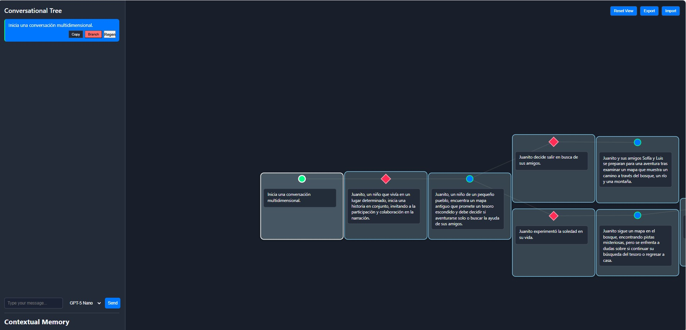

# Conversational Tree (Chat No Lineal con IA) v.1

## Problema a resolver: 
A veces tengo la necesidad de seguir una conversacion con un LLM, pero partiendo de un punto previo. Y no quiero tener que eligir entre una linea u otra. Como no encontre ningun modelo que permitiera eso comenze este proyecto.

OTROS: 
-VISUALIZAR MEJOR LA INFORMACION: Varios UI o modelos tienen la capacidad de crear mapas mentales, pero ningun hasta el momento te permite crearlos en conjunto(practicamente el modelo hace todo). Este lo permite. Ideal para crear por ej:  Mapas-mentales o diagramas de flujo.

-Creo que la gran velocidad y volumen con la que funcionan actualmente los LLM en conjunto con el poco conocimiento general de que ocurre dentro de ellos. Dificultan el aprovechamiento de estos, generando una relacion de dependencia que no favorece el aprendisaje... (blabla) -R:La idea es que este proyecto mejore la relacion que tenemos con los LLM permitiendo una mejor visualizacion de la informacion. Se esta trabajando en una version que: utiliza gpt-5-nano para transformar grandes textos en: PALABRAS CLAVES --> EMOJIES | STICKERS | GIFS | IMAGENES. ; La idea es que recursos más estimulantes como esos permitan recordar mejor de que trata un chat. y poder explorar por que ramas avanza más rapido. 
-
## Objetivo
Crear una interfaz conversacional no lineal (en forma de árbol) donde el usuario y una IA (OpenAI) puedan ramificar la conversación, explorar contextos pasados y mantener memoria contextual relevante. El sistema permite:
- Conversaciones ramificadas (branch en cualquier mensaje).
- Visualización dinámica de la estructura del diálogo.
- Contexto relevante automático (path, siblings y similitud semántica) para mejorar las respuestas de la IA.
- Exportar e importar sesiones para continuar conversaciones previas.
-resumen en palabras claves 

## Arquitectura
### Resumen de Capas
| Capa | Tecnología | Rol |
|------|------------|-----|
| Backend API | Node.js + Express | Endpoints para embeddings y chat, sirve archivos estáticos |
| Cliente (Frontend) | HTML + JS + D3.js | Visualización del árbol, lógica de interacción y contexto |
| OpenAI SDK | `openai` (npm) | Llamadas a modelos (chat + embeddings) |
| Cache en memoria | `Map` | Evita recalcular embeddings repetidos |

